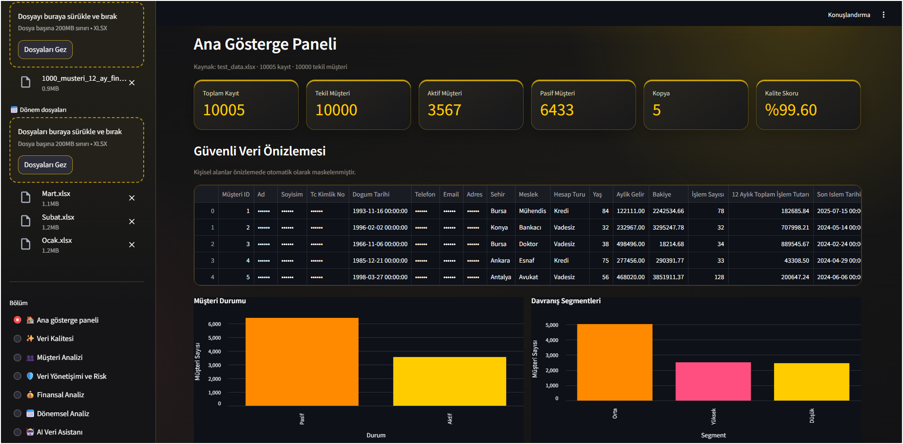
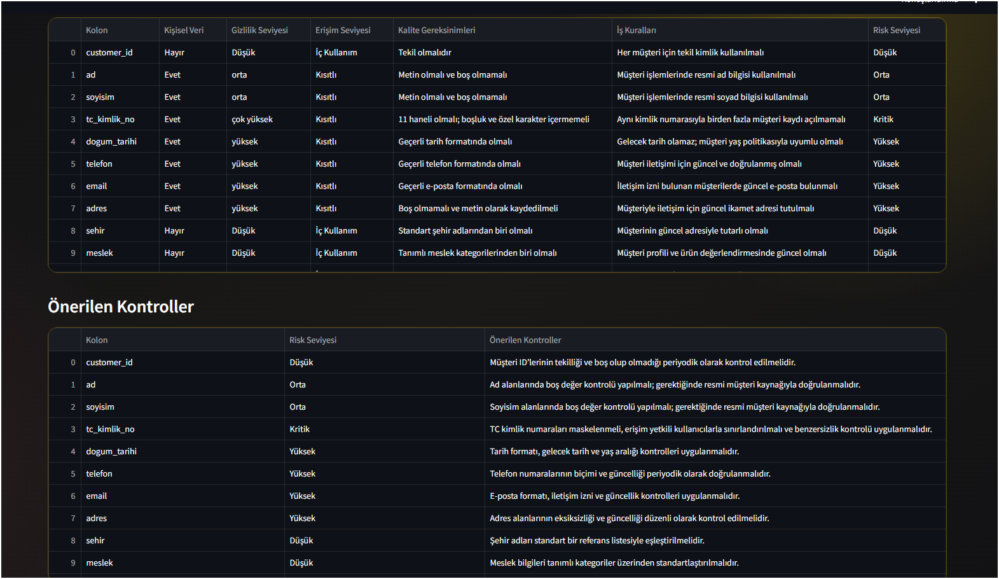
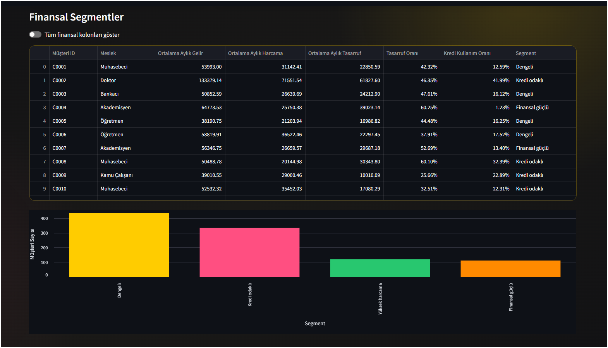
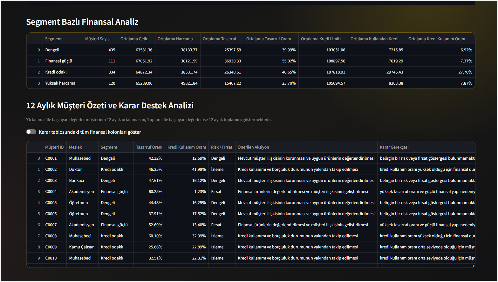
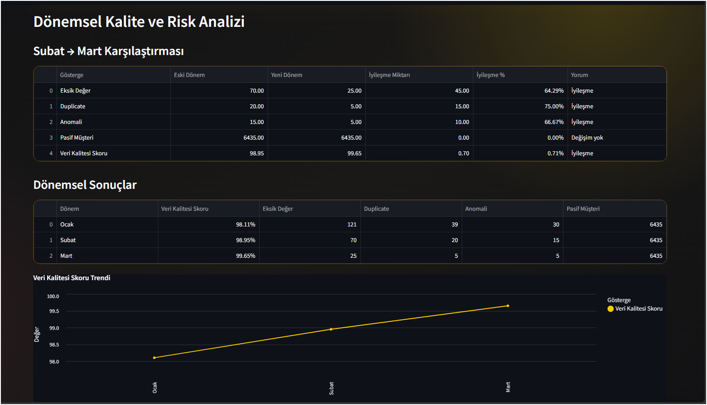

# Finansal Veri Yönetişimi ve Müşteri Analiz Sistemi

Python ve Streamlit kullanılarak geliştirilen bu proje; finansal müşteri verilerinin veri kalitesi, veri yönetişimi ve müşteri davranışları açısından analiz edilmesini sağlayan bir karar destek uygulamasıdır.

Proje kapsamında kullanılan veriler sentetik olarak oluşturulmuştur ve gerçek müşteri verisi içermemektedir.

## Projenin Amacı

Finansal veri setlerindeki veri kalitesi problemlerini tespit etmek, müşteri davranışlarını analiz etmek ve elde edilen sonuçları anlaşılır karar destek çıktıları halinde sunmak amaçlanmıştır.

## Temel Özellikler

- Eksik değer analizi
- Duplicate kayıt tespiti
- Aykırı değer ve anomali analizi
- Veri kalitesi değerlendirmesi
- Kişisel veri ve gizlilik kontrolleri
- Müşteri davranış analizi
- 12 aylık finansal trend analizi
- Müşteri segmentasyonu
- Segment bazlı karar destek çıktıları
- Meslek ve finansal davranış ilişkilerinin analizi
- Streamlit tabanlı interaktif kullanıcı arayüzü
- Yapay zekâ destekli analiz yorumlama

## Araçlar ve Yöntemler

- Python
- Pandas
- NumPy
- Streamlit
- Altair
- OpenAI API
- Exploratory Data Analysis (EDA)
- Anomali Tespiti
- Trend Analizi
- Müşteri Segmentasyonu
- Veri Kalitesi Analizi
- Veri Yönetişimi

## Proje Yapısı

```text
financial-data-governance/
│
├── analysis.py
├── app.py
├── create_data.py
├── requirements.txt
├── sample_data/
└── assets/

```

## Uygulamadan Görüntüler
### Ana Gösterge Paneli



### Veri Yönetişimi ve Risk Analizi



### Müşteri Segmentasyonu



### Karar Destek Analizi



### Dönemsel Veri Kalitesi Analizi


